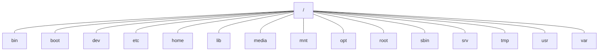

### 26个linux常用指令

https://linux.cn/article-6160-1.html

### linux 快捷键

| 按键            | 作用                       |
| ------------- | ------------------------ |
| Ctrl+d        | 键盘输入结束或退出终端              |
| Ctrl+s        | 暂停当前程序，暂停后按下任意键恢复运行      |
| Ctrl+z        | 将当前程序放到后台运行，恢复到前台为命令`fg` |
| Ctrl+a        | 将光标移至输入行头，相当于`Home`键     |
| Ctrl+e        | 将光标移至输入行末，相当于`End`键      |
| Ctrl+k        | 删除从光标所在位置到行末             |
| Alt+Backspace | 向前删除一个单词                 |
| Shift+PgUp    | 将终端显示向上滚动                |
| Shift+PgDn    | 将终端显示向下滚动                |

### 指令

```
$ who am i 
$ whoami 当前登录用户
$ who -m
```

### linux的7个运行级别（runlevel）

- 运行级别0：系统停机状态，系统默认运行级别不能设为0，否则不能正常启动
- 运行级别1：单用户工作状态，root权限，用于系统维护，禁止远程登陆
- 运行级别2：多用户状态(没有NFS)
- 运行级别3：完全的多用户状态(有NFS)，登陆后进入控制台命令行模式
- 运行级别4：系统未使用，保留
- 运行级别5：X11控制台，登陆后进入图形GUI模式
- 运行级别6：系统正常关闭并重启，默认运行级别不能设为6，否则不能正常启动

### linux目录

. : 当前目录，也可以使用./表示

.. : 上级目录， 也可以使用../来表示

tips： 如果一个文件或者目录以.开始，则表示是一个隐藏文件或目录

### linux系统目录结构

在linux系统中，有几个目录是比较重要的，平时需要注意不要误删除或者随意更改内部文件。

```
/etc：这个是系统中的配置文件，如果你更改了该目录下的某个文件可能会导致系统不能启动。

/bin, /sbin, /usr/bin, /usr/sbin: 这是系统预设的执行文件的放置目录，比如 ls 就是在/bin/ls 目录下的。
值得提出的是，/bin, /usr/bin 是给系统用户使用的指令（除root外的通用户），而/sbin, /usr/sbin 则是给root使用的指令。

/var： 这是一个非常重要的目录，系统上跑了很多程序，那么每个程序都会有相应的日志产生，而这些日志就被记录到这个目录下，具体在/var/log 目录下，另外mail的预设放置也是在这里。


```



### 忘记密码的解决办法

### linux文件基本属性

```
[root@localhost /]# ls -l
total 64
d(文件类型，‘d’表示目录， ‘-’表示文件)r-x（属主权限）r-x（属组权限）r-x（other权限）   2（文件链接个数） root（属主） root（属组） 4096（文件的长度） Dec 14  2012（最后修改日期） bin（文件名或路径名）
dr-xr-xr-x   4 root root 4096 Apr 19  2012 boot
……
```

### chgrp, chown, chmod指令 

1、修改属组

​	chgrp -[R] 属组名 文件名

2、修改属主

​	 chown -[R] 属主名 文件名 或 chown -[R] 属主名:属组名 文件名 

3、修改权限

​	chmod -[R] xyz文件或目录 chmod -[R]  （u g o a）+/- （r w x） 

### 虚拟机网络桥接模式分配linux ip地址

1、vi /etc/sysconfig/network-scripts/ifcfg-eth0

2、修改ONBOOT=yes

3 、service network restart

### 处理目录常用命令

ls, cd, pwd, mkdir, rmdir, cp, rm

###用户

增加用户账号就是在/etc/passwd文件中为新用户增加一条记录，同时更新其他系统文件如/etc/shadow, /etc/group等。

1 添加用户：

useradd  选项  用户名

```
# useradd –d /usr/sam -m sam 
# useradd -s /bin/sh -g group –G adm,root gem
```

2 删除用户

userdel  选项  用户名

```
# userdel -r sam
```

3 修改用户

usermod  选项  用户名

```
# usermod -s /bin/ksh -d /home/z –g developer sam
```

4 用户口令

passwd 选项 用户名

```
# passwd sam // 为sam添加密码 或者修改sam密码
# passwd -d sam // 删除sam的密码，下次登陆的时候就不需要输入密码了
# passwd -l sam // lock用户sam，sam用户成为不可用状态， 使用passwd -u sam 解锁
```

### 用户组

用户组的管理涉及用户组的添加、删除和修改。组的增加、删除和修改实际上就是对/etc/group文件的更新

### who am i 和 whoami的区别

前者查看的是uid，即最先登录的用户，后者查看的euid，而euid是你当前的有效id。比如用su切换到root用户，前者显示的是最先登录的用户名，后者显示的是root，当前用户。


